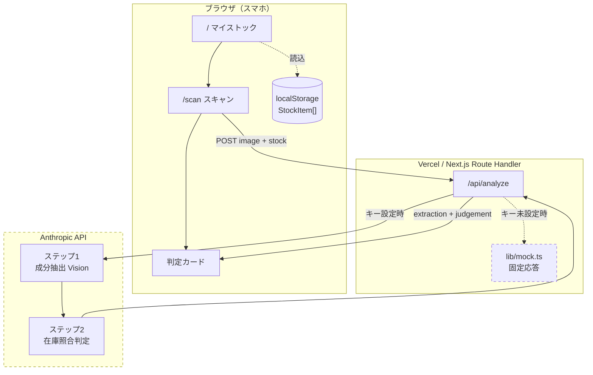
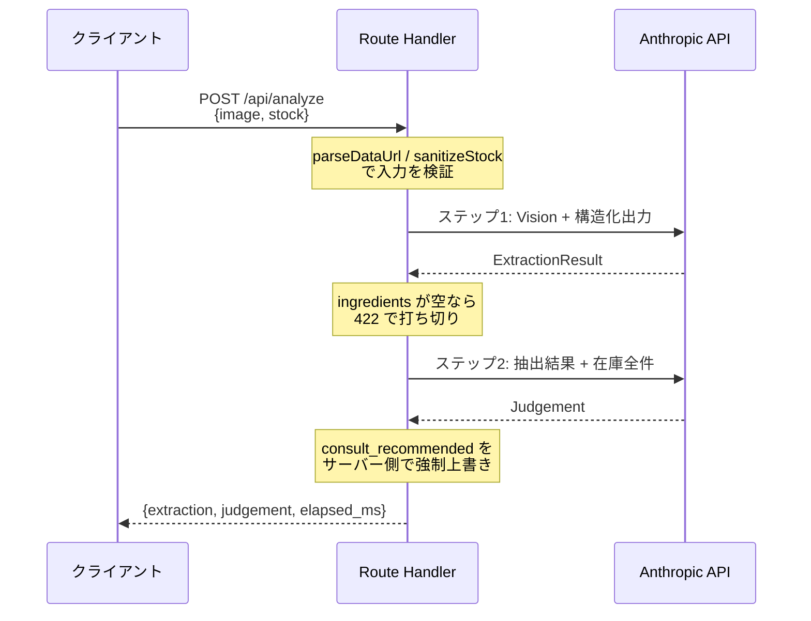
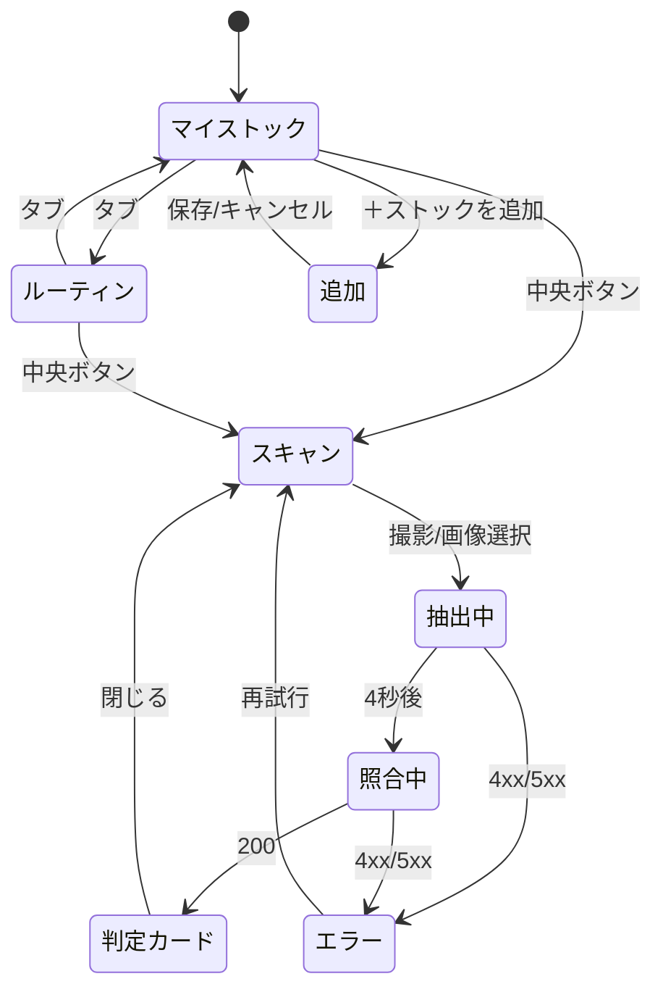

# Overlai 技術ドキュメント

**実装されているもの**を記述する。設計上の合意（何を作るか）は [設計仕様書](設計仕様書_Overlai_デモ版.md) を参照。

| 項目 | 内容 |
| :--- | :--- |
| 対象バージョン | 2026年9月9日時点の `main` |
| 実装規模 | TypeScript 約2,300行（`app/` `components/` `lib/`） |
| 公開URL | https://overlai-delta.vercel.app |
| 稼働モード | **モックモード**（`ANTHROPIC_API_KEY` 未設定のため。§7 参照） |

---

## 1. このアプリが解いている問題

店頭の商品パッケージにカメラをかざすと、**その人の自宅在庫と突合した判定**を返す。

既存のコスメ成分アプリ・お薬手帳アプリは「商品側のデータベース」で戦っており、「あなたの家にもうあるか」だけは商品DBをどれだけ大きくしても答えられない。判定の基準を商品から**その人の家**へ移したことが、この実装の中心にある。

技術的な帰結は2つ。

1. **商品DBを持たない。** 判定に必要なのは在庫データと、スキャンした商品の成分だけ
2. **成分表示を直接読む。** 化粧品のJAN→全成分の公式DBが日本に存在しないため、バーコードではなくパッケージの文字を読む（§4.1）

---

## 2. システム構成



**サーバーは状態を持たない。** 在庫はリクエストごとにクライアントから送られる。これがDBを持たない構成の根拠であり、同時に「服薬情報を端末内に留める」というプライバシー設計でもある。

### 技術スタック

| 層 | 選択 | バージョン | 理由 |
| :--- | :--- | :--- | :--- |
| フレームワーク | Next.js（App Router） | 16.3.4 | Route Handler でAPIキーをサーバー側に隔離できる |
| UI | React | 19.2.8 | — |
| スタイル | Tailwind CSS | 4 | 実装速度 |
| 言語 | TypeScript | 5 | 型定義がそのままAI入出力の契約になる |
| AI | `@anthropic-ai/sdk` | 0.124.0 | Vision + 構造化出力 |
| スキーマ | zod | 4.5.4 | 構造化出力のスキーマ定義 |
| 永続化 | localStorage | — | DB不使用 |
| デプロイ | Vercel | — | HTTPSの公開URLが即座に得られる（カメラAPIの前提） |

---

## 3. ディレクトリ構成と責務

```
app/
  page.tsx              マイストック（在庫一覧・期限アラート・編集）
  routine/page.tsx      今日のルーティン（服薬・洗う順序・塗る順序）
  scan/page.tsx         スキャン（カメラ・画像選択・ローディング・エラー）
  stock/new/page.tsx    在庫の追加（カメラ読み取り＋手入力）
  preview/page.tsx      判定カードのプレビュー（開発用）
  api/analyze/route.ts  判定API（抽出→照合。APIキーを保持する場所）
  api/extract/route.ts  成分抽出のみ（在庫登録用）
  layout.tsx            メタデータ・ビューポート
  globals.css           Tailwind + 日本語フォントスタック

components/
  BottomNav.tsx         3画面のナビゲーション
  StockList.tsx         在庫一覧（カテゴリ別・処方バッジ・期限バッジ）
  JudgementCard.tsx     判定カード（3色・根拠アコーディオン・相談導線）

lib/
  types.ts              全データ構造の定義。AIの入出力契約でもある
  schemas.ts            zodスキーマ（構造化出力の強制）
  prompts.ts            全プロンプトを集約
  seed.ts               デモ用シードデータ10件
  storage.ts            localStorage アクセスの集約点（在庫CRUD・服薬記録）
  routine.ts            洗う／塗る順序のソートと成分バッティング（ルールベース）
  expiry.ts             使用期限・開封後の酸化目安
  request.ts            リクエスト入力の検証（両APIで共有）
  mapping.ts            店頭商品の分類 → 自宅在庫の分類への変換
  image.ts              送信前リサイズ
  mock.ts               モック応答のフィクスチャ
```

### 意図的な集約

| ファイル | なぜ1箇所に集めたか |
| :--- | :--- |
| `lib/prompts.ts` | プロンプトはデモ直前に最も差し替えたくなる。散らばると変更漏れが起きる |
| `lib/storage.ts` | 将来ネイティブ化する際、差し替えるのはこのファイルだけで済むようにする（§8） |
| `lib/types.ts` | 型定義がUI・API・プロンプトの共通言語になる |

---

## 3.5 ルーティンエンジン（AIを使わない部分）

洗う・塗る順序は**ルールベースで組んでいる**（`lib/routine.ts`）。剤形と基剤から順序が一意に決まるため推論を挟む必要がなく、AIを呼ばないぶん決定的に動く。

**どこにAIを使い、どこに使わないかを分けている**ことが、この実装の設計判断のひとつである。

### 塗る順序（アウトバス）

水分が多く浸透の速いものから、油分が多く「蓋」になるものへ並べる。処方外用薬も**剤形で判断する**（ローション基剤は化粧水寄り、軟膏は最後）。

| 剤形 | 重み | 剤形 | 重み |
| :--- | :---: | :--- | :---: |
| 導入液 | 10 | 乳液 | 50 |
| 化粧水 | 20 | クリーム | 60 |
| 美容液 | 30 | 軟膏 | 70 |
| ローション | 40 | オイル | 80 |

シードデータでの出力：化粧水 → 美容液 → ヒルドイドローション（処方）→ ステロイド軟膏（処方）

処方薬が含まれる場合は「医師・薬剤師の指示が優先される」旨を画面に明示する。ここで提示しているのは剤形にもとづく一般的な目安であり、治療方針ではない（§6）。

### 洗う順序（インバス）

シャンプー → トリートメント → 洗顔 → ボディソープ。
トリートメントを流し切ってから体を洗う順序で、髪に残った油分が背中に残ることを避ける。

### 成分バッティング

同時使用で刺激になる可能性が指摘されている組み合わせのみを列挙する（レチノール × 高濃度ビタミンC、レチノール × AHA/BHA、ビタミンC × AHA/BHA）。断定はせず「〜の可能性があります」で統一する。

### 期限・酸化目安（`lib/expiry.ts`）

| 剤形 | 開封後の目安 |
| :--- | :---: |
| オイル・美容液・軟膏 | 3ヶ月 |
| 化粧水・乳液・クリーム・ローション・導入液 | 6ヶ月 |
| 洗顔・シャンプー・トリートメント・ボディソープ | 12ヶ月 |

使用期限（`expiresAt`）があればそちらを優先する。残り30日以内で `soon`、超過で `expired`。
「使い切らないまま期限を迎える」損失を減らすことがねらい（企画書 §9-3）。

### 服薬記録と残薬

服薬を記録すると残薬が同時に減る。記録と残量を別々に管理するとズレるため、`toggleDose()` で一括して扱っている。

---

## 4. AIパイプライン

### 4.1 なぜJANコードを使わないのか

化粧品のJAN→全成分の公式データベースは**日本に存在しない**。医薬品は添付文書がPMDAにあるが、化粧品の全成分は各社の任意開示に留まる。

そのため**バーコードではなくパッケージの成分表示そのものを読む**。これは妥協ではなく、非定型な表示を解釈できる生成AIでなければ実装できない方式であり、そのまま「なぜ生成AIが必要か」の説明になる。

### 4.2 なぜ2段階に分けるのか

単一プロンプトで「画像を見て判定まで出せ」とすると3点が崩れる。

| 崩れるもの | 内容 |
| :--- | :--- |
| 精度 | 読み取りと推論を同時に要求すると成分の取りこぼしが増える |
| 検証可能性 | ユーザーが「何を読み取ったか」を確認できない＝ハルシネーション対策が成立しない |
| デバッグ性 | 判定がおかしいとき、読み取りの問題か推論の問題か切り分けられない |

分割の単位は**パイプラインであってエンドポイントではない**。APIは1本に集約している（往復2回だとレイテンシが倍増するため）。



### 4.3 モデル設定と根拠

| ステップ | モデル | effort | 根拠 |
| :--- | :--- | :--- | :--- |
| 1. 成分抽出 | `claude-opus-5` | `medium` | 読み取り主体だが、精度が判定品質の上流にある |
| 2. 在庫照合判定 | `claude-opus-5` | `high` | 成分間の関係推論が判定品質そのもの。**ここは下げない** |

**thinking は無効化していない。** `claude-opus-5` は adaptive thinking が既定でオンになる。無効化するとツール呼び出しや内部タグが本文テキストに混入する既知の失敗モードがあるため、レイテンシは thinking の無効化ではなく `effort` で調整する。

`max_tokens: 16000` としているのは、**thinking トークンもここから消費される**ため。4,000程度に絞ると出力が途中で切れて再試行が発生する。

**チューニング方針**: レイテンシが10秒を超える場合、**ステップ1のみ** `medium` → `low` の順に下げる。ステップ2は下げない。

### 4.4 構造化出力

出力形式は zod スキーマで強制する（`lib/schemas.ts`）。

```ts
output_config: { format: zodOutputFormat(ExtractionSchema), effort: 'medium' }
```

これにより「JSONのみを返せ」「コードフェンス禁止」といったプロンプトでの整形依頼が**不要になる**。パース失敗は原理的に起こらない。

さらに重要なのは、`Reason.ingredient` を**必須フィールドにしている**点。「根拠なき警告を出さない」という安全制約を、プロンプトのお願いではなく**スキーマレベルで**強制している（§6）。

### 4.5 判定ルール

`lib/prompts.ts` の `JUDGEMENT_SYSTEM_PROMPT` に決定表として記述。上から評価し、最初に該当したシグナルを採用する。

| 優先 | signal | 条件 |
| :---: | :---: | :--- |
| 1 | 🔴 red | 在庫の**処方薬**との併用でリスク・強い刺激・**過量摂取**が想定される |
| 2 | 🟡 yellow | 在庫に同一成分／同効能の**市販品**が存在する（処方薬が絡まない） |
| 3 | 🔵 blue | 上記いずれにも該当しない |

> **🟡と🔴の境界は「処方薬が絡むか」。**
> 同じ成分重複でも、処方薬との重複は**過量摂取リスク**なので🔴、市販品どうしの重複は「買う必要がない」なので🟡。
> この線引きが安全設計の中核であり、デモの都合で緩めていない。代わりに**シードデータ側を調整している**（§5.2）。

---

## 5. データモデル

### 5.1 型定義

```ts
StockItem        自宅在庫。判定の基準となるデータ
ExtractionResult ステップ1の出力（画像 → 成分の構造化）
Judgement        ステップ2の出力（3色シグナル + 根拠）
Reason           判定理由。ingredient が必須
```

`ExtractionResult.category` と `StockCategory` は**別軸であり、値が一致しないのは意図的**。前者は店頭商品の分類（処方薬は店頭に並ばない）、後者は自宅在庫の分類（処方の内服・外用を区別する必要がある）。一方を他方へキャストしてはならない。

### 5.2 シードデータの設計上の制約

`lib/seed.ts` の7件は、🔵🟡🔴すべてを出せる構成になっている。

> ⚠ **内服薬のシードに処方NSAIDsを置いてはならない。**
> 処方のロキソプロフェン等が在庫にあると、市販イブプロフェン製剤のスキャンが
> 「NSAIDsの重複投与＝過量摂取リスク」として🔴の条件にも該当し、🟡判定が不安定になる。
> 判定ルールは医学的に正しいので、**ルールではなくシードを調整する**。
> `stk-001` を抗アレルギー薬（フェキソフェナジン）にしてあるのはこのため。

| スキャン対象 | 該当する在庫 | 判定 |
| :--- | :--- | :---: |
| 市販のイブプロフェン製剤 | stk-002 イブA錠（同一成分） | 🟡 |
| アルコール系・サリチル酸配合の化粧水 | stk-004 ステロイド外用（顔） | 🔴 |
| ワックス落とし用シャンプー | stk-007 アミノ酸系シャンプー（用途違い） | 🔵 |

---

## 6. 安全性の実装

医療に隣接するため、安全制約は**プロンプトだけに頼らず多層で強制**している。

| 制約 | 強制する層 | 実装箇所 |
| :--- | :--- | :--- |
| 断定表現を使わない | プロンプト | `lib/prompts.ts` |
| 診断・治療方針を提示しない | プロンプト | `lib/prompts.ts` |
| 判定理由に必ず成分名を含める | **スキーマ**（必須フィールド） | `lib/schemas.ts` |
| 成分名のない理由を出さない | **サーバー側フィルタ** | `route.ts`（`reasons.filter`） |
| 赤なら必ず相談を促す | **サーバー側で上書き** | `route.ts` |
| 相談導線を常設する | UI（全判定色） | `JudgementCard.tsx` |
| 免責の明示 | UI（カード下部固定） | `JudgementCard.tsx` |
| 服薬情報を端末内に留める | 設計（DB不使用） | `lib/storage.ts` |

`consult_recommended` はモデルの出力を信用せず、サーバー側で上書きする。

```ts
consult_recommended: raw.signal === 'red' ? true : raw.consult_recommended,
reasons: raw.reasons.filter((r) => r.ingredient.trim().length > 0),
```

**安全に関わる値をLLMの判断に委ねない**という方針そのものが、この実装の設計思想である。

---

## 7. モックモード

**現在のデプロイはこのモードで動いている。**

`ANTHROPIC_API_KEY` が未設定のとき、`/api/analyze` は `lib/mock.ts` の固定応答を返す。**AIは呼ばれていない。**

```ts
function useMock(): boolean {
  return process.env.OVERLAI_MOCK === '1' || !process.env.ANTHROPIC_API_KEY;
}
```

| 項目 | 挙動 |
| :--- | :--- |
| シナリオ選択 | `?demo=yellow\|red\|blue`。マイストックからスキャン画面へ引き継がれる |
| 応答時間 | 5.2秒の待機を挟む（2段階ローディングが映る程度） |
| 識別 | レスポンスに `mocked: true`。サーバーログに警告を出力 |

**本物への切り替えはキーを設定するだけでよい。コード変更は不要。** Anthropic クライアントは遅延生成にしてあるため、キーがなくてもアプリは正常に起動する。

---

## 8. 状態管理と永続化

在庫は localStorage に保存し、`lib/storage.ts` に**アクセスを集約**している。

```ts
loadStock()   キーが無ければシードで初期化。読み取り失敗時もシードで継続
saveStock()   保存失敗を握りつぶす（プライベートモード等）
resetStock()  シードへ戻す
```

SSR時点でシードを初期値として描画し、ハイドレーション後に localStorage の値で更新する。初回描画が空にならないようにするため。

### ネイティブ化を見据えた分離

| レイヤ | ネイティブ移行時 |
| :--- | :--- |
| `lib/prompts.ts` `lib/types.ts` `lib/schemas.ts` | **そのまま再利用できる** |
| `app/api/analyze/route.ts` | **変更不要**。ネイティブからも同一エンドポイントを叩く |
| `lib/storage.ts` | **このファイルだけ**を AsyncStorage 等に差し替える |
| `app/` `components/` | 全面的に書き直し |

**`localStorage` をコンポーネントから直接呼ばない。** この1点を守るかどうかで、将来の移植が「1ファイルの差し替え」か「全面調査」かに分かれる。

判定エンジンはWeb/ネイティブ共通のバックエンドとして残るため、ネイティブ化してもUI層以外は資産として残る。

---

## 9. API仕様

### `POST /api/analyze`

クライアントが叩くエンドポイントはこれ1本のみ。

**Request**

```jsonc
{
  "image": "data:image/jpeg;base64,...",  // 長辺1568px以下・最大5MB
  "stock": [ /* StockItem[] */ ],          // 最大50件
  "demo": "yellow"                         // モックモード時のみ有効
}
```

**Response 200**

```jsonc
{
  "extraction": { /* ExtractionResult */ },
  "judgement":  { /* Judgement */ },
  "elapsed_ms": 4210,
  "mocked": true    // モックモード時のみ
}
```

**エラー**

| status | code | 発生条件 |
| :---: | :--- | :--- |
| 400 | `INVALID_IMAGE` | data URL が不正／サイズ超過／在庫データが不正 |
| 422 | `EXTRACTION_FAILED` | `ingredients` が空（成分表示を読み取れなかった） |
| 429 | `RATE_LIMITED` | レート制限 |
| 500 | `UPSTREAM_ERROR` | 認証・接続・APIエラー |

> **`confidence` は422の条件に含めない。** `confidence: 'low'` でも `ingredients` が1件以上あれば判定を実行し、カードに「読み取り精度が低い可能性があります」を添える。低確信を理由に判定を止めると、実機で最も起きやすい「少しボケた写真」で必ず失敗する。

### 入力の検証

`stock` はクライアント由来の入力であり、そのままプロンプトへ結合される経路にある。

| 検証 | 上限 |
| :--- | :--- |
| 在庫件数 | 50件 |
| 各フィールド長 | 200文字 |
| 成分数 | 30件 |
| 画像サイズ | 5MB（base64は約4/3に膨らむ点を考慮） |
| 画像形式 | jpeg / png / webp / gif のdata URLのみ |

### エラーハンドリング

具体的な例外から順に判定する（広い catch 一本にしない）。

```
RateLimitError → AuthenticationError → APIConnectionError → APIError → その他
```

---

## 10. 画面

### 遷移



企画書の「画面は3つ：スキャナー／マイストック／今日のルーティン」に対応する。
在庫の追加は3画面の外側に置き、日常の導線を3つに保っている。

### 2段階ローディング

```
「成分を読み取っています…」  → ステップ1
「家の在庫と照合しています…」 → ステップ2
```

**これは演出ではなく仕様。** 2段階パイプラインで動いていることが映像で伝わる。

ただし実装上は、APIが1リクエストであるため**経過時間（4秒）で表示を切り替えている**。実測の進捗ではない。ステップ1が終わるまでは必ず「読み取り中」なので、時間ベースでもおおむね実態と一致する。

### カメラのフォールバック

**実機デモで最も事故が起きるのはカメラである。** そのため「画像を選ぶ」は保険ではなく本線として扱い、常時表示している。カメラ起動に失敗しても、画像選択だけでデモの全ステップが完走できる。

### 配色

| signal | 色 | 備考 |
| :---: | :--- | :--- |
| blue | `#2563EB` | |
| yellow | `#D97706` | 視認性のため黄色ではなくアンバー |
| red | `#DC2626` | |

---

## 11. 技術的意思決定の記録

| # | 決定 | 却下した案 | 理由 |
| :---: | :--- | :--- | :--- |
| 1 | 成分表示を直接読む | JANコード照合 | 化粧品の公式成分DBが日本に存在しない |
| 2 | AIを2段階に分ける | 単一プロンプト | 精度・検証可能性・デバッグ性が崩れる |
| 3 | APIは1本に集約 | 抽出/判定で2本 | 往復2回でレイテンシが倍増する |
| 4 | 構造化出力を使う | プロンプトでJSON整形を依頼 | パース失敗が原理的に起こらない。安全制約もスキーマで強制できる |
| 5 | `consult_recommended` をサーバー上書き | モデル出力を信用 | 安全に関わる値をLLMに委ねない |
| 6 | thinking を無効化しない | 無効化してレイテンシ短縮 | ツール呼び出しの本文混入など既知の失敗モードがある |
| 7 | DBを持たない | Postgres等 | 映像に映らない。服薬情報を端末内に留められる |
| 8 | Webアプリ | React Native / Swift | ストア審査が締切に間に合わない。**審査員がその場でURLを開ける** |
| 9 | シードを調整 | 判定ルールを緩める | 安全設計を弱めずに🟡を安定させる |
| 10 | モックモードを実装 | APIキーを取得 | 費用をかけずにデモを成立させる。キー設定だけで本物に切り替わる |
| 11 | 順序ナビをルールベースで組む | AIに順序を決めさせる | 剤形から順序が一意に決まる。AIを挟むと不安定になるうえ遅い |
| 12 | 服薬記録と残薬を同一関数で更新 | 別々に管理 | 記録と残量がズレる |
| 13 | 抽出専用のエンドポイントを分けた | analyze を使い回す | 在庫登録では在庫照合が不要。ステップ2を走らせるのは無駄 |

---

## 12. 既知の制約・未実装

| 項目 | 状態 |
| :--- | :--- |
| **本物のAIパイプライン** | **未検証。** 現在モックで迂回している（Issue #13） |
| カメラの実機動作 | HTTPS環境ができたため確認可能（Issue #8） |
| エラー系の実挙動 | 本物のAI経路でのみ発生するため未検証（Issue #9） |
| 在庫の追加・削除 | **実装済み**（カメラ読み取り＋手入力） |
| 在庫の編集（既存項目の書き換え） | 未実装。削除して追加し直す運用 |
| JAHIS QR・レシート登録 | 未実装（登録経路としては優先度が低い） |
| 塗る／洗う順序ナビ | **実装済み**（ルールベース・§3.5） |
| 使用期限・酸化目安 | **実装済み** |
| 服用カレンダー・残薬カウント | **実装済み**（当日分のみ。履歴画面は未実装） |
| PWA対応 | 未実装（Issue #11・優先度低） |
| 認証・DB・通知 | **実装しない**（デモのスコープ外） |

### 2段階ローディングの正確性

前述のとおり時間ベースで切り替えている。実測の進捗を出すにはAPIをSSEにする必要があるが、デモの範囲では過剰と判断した。

---

## 13. 開発・デプロイ

```bash
npm install
npm run dev              # モックモードで起動
npx tsc --noEmit         # 型チェック
npx next build           # 本番ビルド
vercel --prod --yes      # デプロイ
```

| 環境変数 | 用途 |
| :--- | :--- |
| `ANTHROPIC_API_KEY` | 設定すると本物のAIパイプラインに切り替わる |
| `OVERLAI_MOCK=1` | キーがある状態で強制的にモックへ戻す |

---

*Overlai 技術ドキュメント ／ 2026年9月9日*
